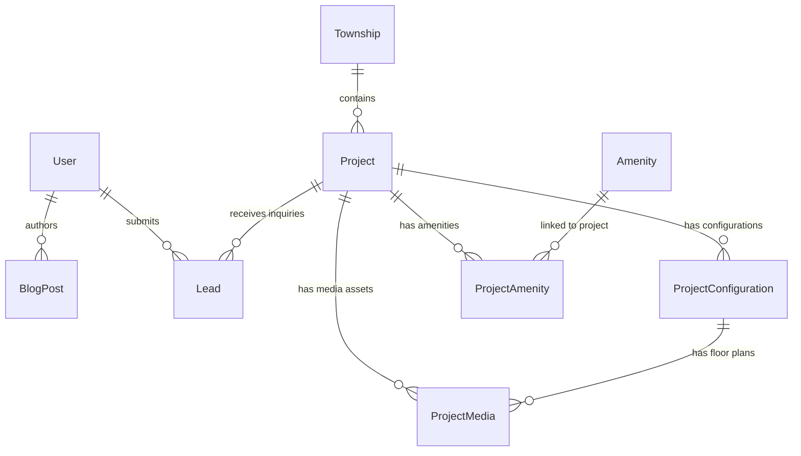

# Real Estate Full-Stack Project: Technical Interview Guide & Schema Design

> **Project Stack Overview**
> - **Frontend:** Next.js 16 (App Router), React 19, Tailwind CSS v4, Framer Motion, Shadcn / Base UI, TipTap Editor, Swiper/Embla Carousel, Axios, DOMPurify.
> - **Backend:** Express 5, TypeScript, Prisma ORM 6, PostgreSQL, JWT Authentication, Multer & Cloudinary Media Pipeline, `express-rate-limit`, CORS.
> - **Database:** PostgreSQL managed via Prisma ORM (`postgresql://`).

---

## 1. Database Schema Design & ER Diagram

### 1.1 Entity-Relationship (ER) Diagram



---

### 1.2 Comprehensive Schema Breakdown

#### 1. `User` Model
Represents consumers and system administrators.
- **Fields:**
  - `id`: `String` (`cuid()`, Primary Key)
  - `name`: `String`
  - `email`: `String?` (Unique)
  - `phone`: `String?` (Unique)
  - `password`: `String?` (Bcrypt hash)
  - `role`: `Role` Enum (`CONSUMER` | `ADMIN`, default `CONSUMER`)
  - `isVerified`: `Boolean` (default `false`)
  - `isBlocked`: `Boolean` (default `false`)
  - `createdAt`: `DateTime` (default `now()`)
  - `updatedAt`: `DateTime` (`@updatedAt`)
- **Indexes:** `@@index([role])` (Fast authorization and user role filtering)

#### 2. `Township` Model
Represents large master-planned land developments hosting multiple projects.
- **Fields:**
  - `id`: `String` (`cuid()`, Primary Key)
  - `name`: `String`
  - `description`: `String?`
  - `locality`: `String`
  - `city`: `String` (default `"Mumbai"`)
  - `address`: `String`
  - `latitude` / `longitude`: `Float?` (Geo-coordinates)
  - `googleMapUrl`: `String?`
  - `slug`: `String` (Unique SEO friendly URL)
  - `createdAt` / `updatedAt`: `DateTime`

#### 3. `Project` Model (Core Entity)
Represents real estate listings/developments.
- **Fields:**
  - `id`: `String` (`cuid()`, Primary Key)
  - `title`: `String`
  - `slug`: `String` (Unique)
  - `description`: `String?`
  - `propertyType`: `PropertyType` Enum (`APARTMENT`, `FLAT`, `BUNGALOW`, `VILLA`, `PLOT`, `ROW_HOUSE`, `COMMERCIAL`)
  - `constructionStatus`: `ConstructionStatus` Enum (`UNDER_CONSTRUCTION`, `READY_TO_MOVE`, `NEW_LAUNCH`, `NONE`)
  - `propertyView`: `PropertyView` Enum (`GARDEN`, `POOL`, `LAKE`, `CITY`, `NONE`)
  - `videoUrl`: `String?`
  - `address` / `googleMapUrl` / `latitude` / `longitude`
  - `featured`: `Boolean` (default `false`)
  - `status`: `ProjectStatus` Enum (`ACTIVE`, `SOLD_OUT`, `UPCOMING`, `INACTIVE`)
  - `townshipId`: `String?` (Foreign key to `Township`)
  - `reraId`: `String?` (Regulatory ID)
  - `reraQrCode`: `String?` (Regulatory QR code image URL)
  - `createdAt` / `updatedAt`: `DateTime`
- **Performance Indexes:**
  - `@@index([featured])`: Rapid rendering of featured properties on home page.
  - `@@index([status])`: Filtering active properties across public catalog pages.
  - `@@index([propertyType])`: Categorical search filtering.
  - `@@index([constructionStatus])`: Filtering by `READY_TO_MOVE` or `NEW_LAUNCH`.
  - `@@index([townshipId])`: Relational join lookups.
  - `@@index([createdAt])`: Sorting listings by recency.

#### 4. `ProjectConfiguration` Model
Defines specific sub-units within a project (e.g., 1 BHK, 2 BHK, 3 BHK).
- **Fields:**
  - `id`: `String` (`cuid()`, Primary Key)
  - `projectId`: `String` (Foreign key to `Project`, `onDelete: Cascade`)
  - `bhk`: `Int` (e.g., 1, 2, 3, 4)
  - `carpetArea` / `builtUpArea` / `superBuiltUpArea`: `Float`
  - `pricePerSqft` / `totalPrice`: `Float`
  - `label`: `String?` (e.g., "Premium Tower A 2BHK")
  - `availableUnits`: `Int?`
  - `isAvailable`: `Boolean` (default `true`)

#### 5. `ProjectMedia` Model
Media assets linked to projects or specific unit configurations.
- **Fields:**
  - `id`: `String` (`cuid()`, Primary Key)
  - `projectId`: `String` (Foreign Key to `Project`, `onDelete: Cascade`)
  - `configurationId`: `String?` (Optional foreign key to `ProjectConfiguration`, `onDelete: Cascade`)
  - `url`: `String` (Cloudinary CDN URL)
  - `type`: `MediaType` Enum (`IMAGE`, `BROCHURE`, `FLOOR_PLAN`)
  - `isCover`: `Boolean` (default `false`)
  - `sortOrder`: `Int` (default `0`)
- **Performance Indexes:**
  - `@@index([projectId, type])`: Retrieves media gallery filtered by type.
  - `@@index([projectId, isCover])`: Fetches listing thumbnail instantly.

#### 6. `Amenity` & `ProjectAmenity` (Many-to-Many Junction Table)
- **`Amenity`:** `id`, `name` (Unique), `category` (default `"General"`)
- **`ProjectAmenity`:** `id`, `projectId`, `amenityId`, `createdAt`
  - `@@index([projectId])`: Rapid join performance.

#### 7. `Lead` Model (CRM & Customer Inquiries)
- **Fields:**
  - `id`: `String` (`cuid()`, Primary Key)
  - `userId`: `String?` (Optional link to logged-in user)
  - `projectId`: `String?` (Optional link to queried project)
  - `name`: `String`
  - `phone`: `String`
  - `type`: `LeadType` Enum (`CALLBACK`, `SITE_VISIT`, `VIDEO_TOUR`, `SELL_REQUEST`)
  - `message`: `String?`
  - `preferredDate`: `DateTime?`
  - `preferredSlot`: `String?`
  - `status`: `LeadStatus` Enum (`NEW`, `CONTACTED`, `CLOSED`, `CANCELLED`, default `NEW`)
- **Indexes:** `@@index([phone])`, `@@index([type])`, `@@index([status])`

#### 8. `BlogPost` Model (CMS Engine)
- **Fields:**
  - `id`: `String` (`cuid()`, Primary Key)
  - `authorId`: `String` (Foreign key to `User`)
  - `title` / `slug` (Unique) / `metaTitle` / `metaDescription` / `excerpt` / `coverImage`
  - `content`: `String` (Sanitized TipTap HTML string)
  - `locality`: `String?`
  - `tags`: `String[]`
  - `published`: `Boolean` / `publishedAt`: `DateTime?`
- **Indexes:** `@@index([published])`, `@@index([slug])`, `@@index([locality])`

#### 9. `SiteSettings` Model (Global RERA Metadata)
- **Fields:** `id` (`"global"`), `agentReraNumber`, `agentReraValidUpTo`, `updatedAt`

---

## 2. Technical Interview Questions & Answers

### Part A: Database & Schema Design

#### Q1: Why use PostgreSQL and Prisma ORM for a Real Estate platform?
**Answer:**
- **Strict Data Integrity:** Real estate platforms handle financial figures (pricing per sq.ft.), unit availability, and strict regulatory compliance (RERA). PostgreSQL provides ACID compliance and robust relational constraints.
- **Relational Integrity with Cascading:** Foreign key relations (e.g., `Project` -> `ProjectConfiguration` and `ProjectMedia`) with `onDelete: Cascade` ensure deleting a project automatically cleans up linked floor plans and media records, keeping the database clean.
- **End-to-End Type Safety:** Prisma automatically generates TypeScript types from `schema.prisma`, ensuring compile-time safety across API handlers, repositories, and UI components.

#### Q2: Explain the indexing strategy used in this schema.
**Answer:**
In real estate platforms, read queries far outnumber write operations. Indexes were chosen based on frequency:
1. **Homepage & Catalog Filtering:** `@@index([status])` and `@@index([featured])` on `Project` allow fetching active, featured properties without performing full table scans.
2. **Category Search:** `@@index([propertyType])` and `@@index([constructionStatus])` accelerate queries when buyers filter properties (e.g., "Ready-to-move Apartments").
3. **Media Retrieval:** Compound index `@@index([projectId, isCover])` allows fetching property cover photos immediately for listing cards.
4. **CRM Admin Dashboard:** Indexes on `phone`, `type`, and `status` in `Lead` allow admins to filter leads quickly.

#### Q3: How is the relationship between `Project` and `Amenity` modeled?
**Answer:**
It is modeled using an explicit Many-to-Many junction entity (`ProjectAmenity`). Instead of an implicit Prisma array or storing amenity IDs as strings, an explicit junction table allows adding metadata in the future (e.g., amenity status or custom descriptions) and enables explicit index creation (`@@index([projectId])`) to optimize relational joins.

---

### Part B: Backend Architecture & API Design (Express.js, TypeScript, Prisma)

#### Q4: How is Role-Based Access Control (RBAC) implemented?
**Answer:**
Auth uses JWT (JSON Web Tokens) with a custom middleware chain:
1. `authenticate`: Verifies token signature from HTTP-only cookies or Authorization headers and populates `req.user`.
2. `requireRole(Role.ADMIN)`: Inspects `req.user.role`. If the user is a `CONSUMER`, it returns a `403 Forbidden` response. Sensitive operations (modifying RERA settings, managing project listings, managing leads) are restricted to `ADMIN`.

#### Q5: How do you handle file uploads for property images, floor plans, and brochures?
**Answer:**
- **Multer Middleware:** Handles multipart form-data.
- **Cloudinary Integration:** Uses `multer-storage-cloudinary` to stream uploaded images/documents directly to Cloudinary CDN rather than buffering them in backend server memory.
- **DB Persistence:** Stores the resulting Cloudinary CDN URL, file type (`IMAGE`, `BROCHURE`, `FLOOR_PLAN`), and `sortOrder` in `ProjectMedia`.

#### Q6: How do you handle search filters across price range, BHK, and property type?
**Answer:**
We dynamically build Prisma query `where` clauses based on incoming query parameters:
```typescript
const where: Prisma.ProjectWhereInput = { status: 'ACTIVE' };

if (propertyType) where.propertyType = propertyType as PropertyType;
if (constructionStatus) where.constructionStatus = constructionStatus as ConstructionStatus;

if (bhk || minPrice || maxPrice) {
  where.configurations = {
    some: {
      ...(bhk && { bhk: Number(bhk) }),
      ...(minPrice && { totalPrice: { gte: Number(minPrice), lte: Number(maxPrice || Infinity) } })
    }
  };
}

const projects = await prisma.project.findMany({
  where,
  include: { configurations: true, media: { where: { isCover: true } } }
});
```

---

### Part C: Frontend Architecture & Performance (Next.js 16, React 19, Tailwind)

#### Q7: Why use Next.js 16 App Router for a real estate portal?
**Answer:**
- **SEO & Dynamic Metadata:** Search engine visibility is vital for real estate. Next.js Server Components generate static HTML and dynamic meta tags on the server for Google crawlers.
- **Performance Optimization:** Pages like Property Details use Server Components for instant HTML delivery. Client Components (`'use client'`) are reserved for interactive elements like image carousels, schedule site-visit modals, and rich text editing.

#### Q8: How do you prevent XSS attacks when rendering blog post HTML?
**Answer:**
Blog post content is created via TipTap editor and saved as raw HTML string in PostgreSQL. When rendering on Next.js frontend, `isomorphic-dompurify` cleans the HTML string before passing it to `dangerouslySetInnerHTML`:
```tsx
import DOMPurify from 'isomorphic-dompurify';

export function BlogContent({ content }: { content: string }) {
  const sanitizedContent = DOMPurify.sanitize(content);
  return <div dangerouslySetInnerHTML={{ __html: sanitizedContent }} />;
}
```

---

### Part D: Real-World Business Logic & System Design

#### Q9: How does the system handle Lead generation and Site Visit bookings?
**Answer:**
Users submit inquiries via a form specifying lead type (`CALLBACK`, `SITE_VISIT`, `VIDEO_TOUR`, `SELL_REQUEST`), preferred date/time slot, phone number, and optional project ID.
- The backend validates phone formats and dates.
- A new `Lead` record is generated with status `NEW`.
- The Admin dashboard displays leads categorized by status (`NEW`, `CONTACTED`, `CLOSED`) with filtering by lead type and phone search.

#### Q10: How would you scale this system to handle 100,000 requests per minute during a high-profile real estate project launch?
**Answer:**
1. **Edge Caching & CDN:** Cache static property pages and media assets on Vercel/Cloudflare CDN.
2. **Redis Query Caching:** Cache database query results for active project listings and site settings in Redis to reduce PostgreSQL load.
3. **Asynchronous Lead Processing:** Queue lead creation requests using Redis & BullMQ so the API server returns an instant `202 Accepted` response while background workers insert records and dispatch SMS/WhatsApp confirmation alerts.
4. **Rate Limiting:** Protect APIs against abuse using `express-rate-limit`.
